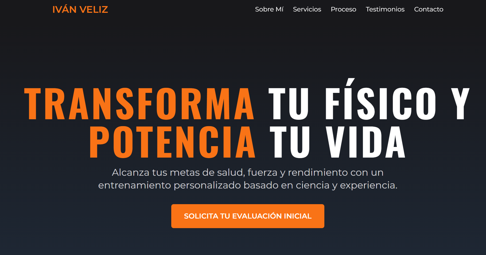
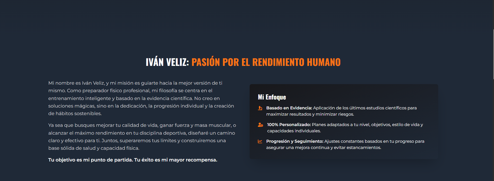
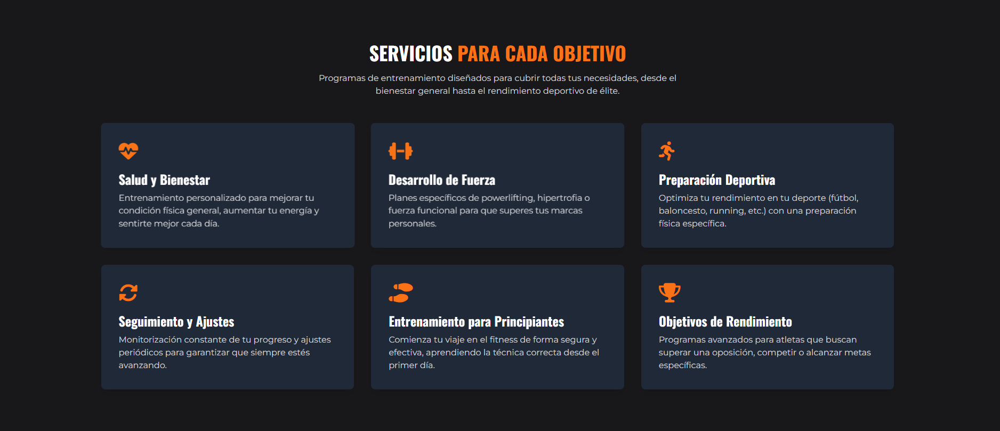
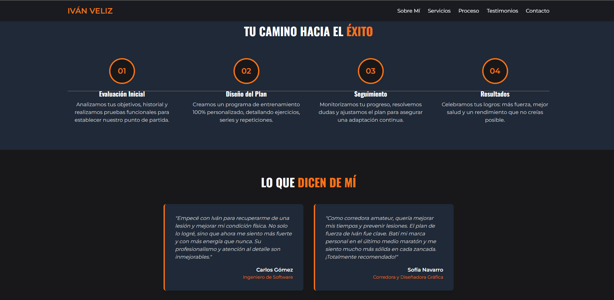
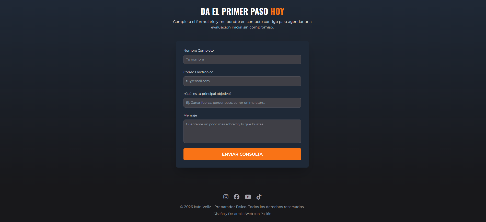
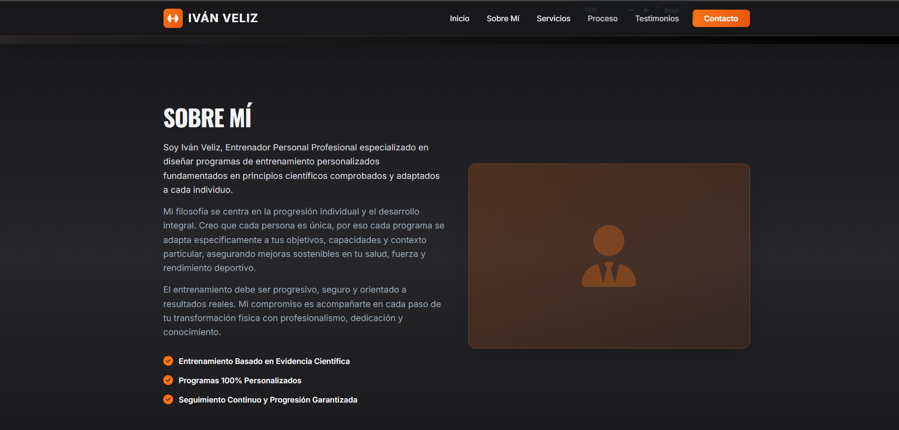
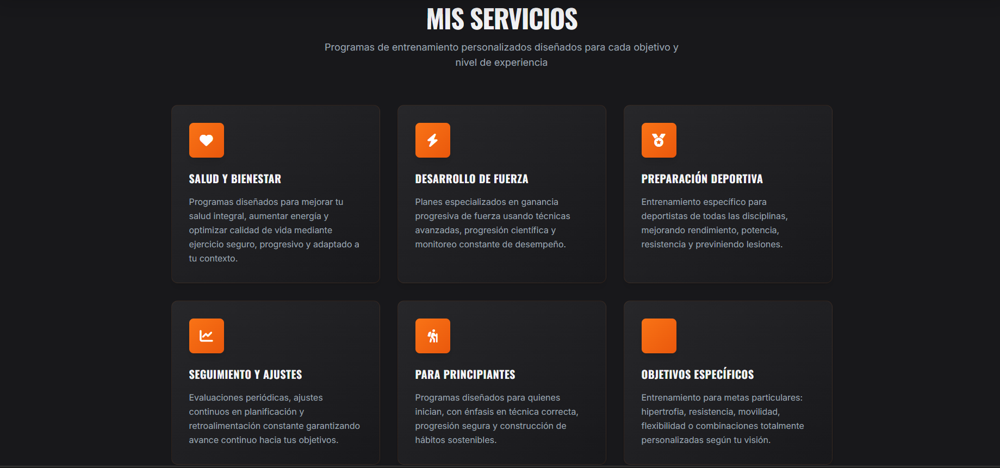
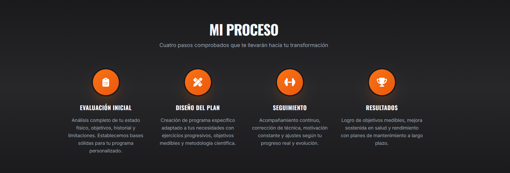
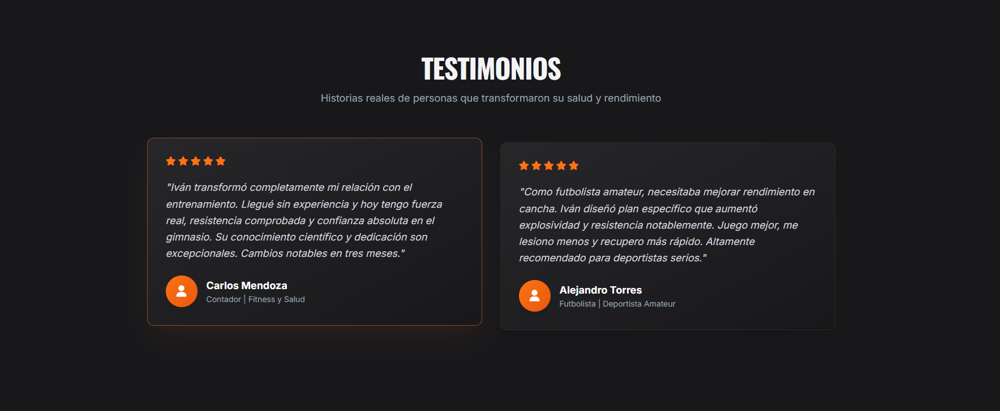
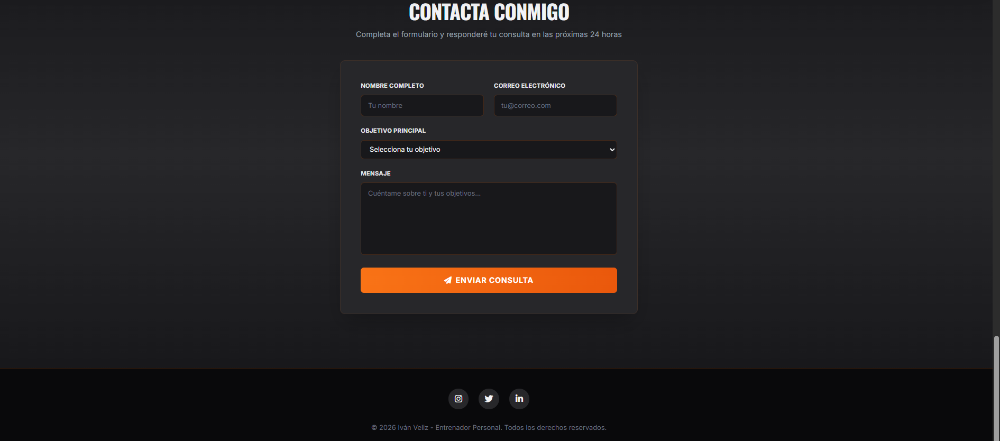

# Evaluación de Agentes Autónomos: Comparativa de Landing Pages

Este proyecto es un experimento de evaluación de agentes de IA mediante una técnica de **Zero-Shot Prompting**. El objetivo es comparar la capacidad de diferentes modelos de lenguaje (LLMs) para actuar como desarrolladores frontend autónomos.

## 👤 Datos del estudiante
* **Nombre:** Iván Veliz


## 🚀 Link al deploy unificado
Desde el siguiente enlace se accede a la portada principal desplegada en Vercel, la cual distribuye hacia los resultados generados por cada agente:
👉 **[https://pfo-2-frontend-itfs29-hazel.vercel.app/]**

---

## 📝 El prompt exacto utilizado
Para este experimento, se utilizó el siguiente prompt de manera idéntica en ambos agentes evaluados (Gemini 1.5 Flash y Claude 3.5 Haiku):

```text
Actúa como un Desarrollador Frontend experto y diseñador UI/UX especializado en landing pages de alta conversión. Tu tarea es generar el código completo de una Landing Page moderna y responsiva para un Preparador Físico profesional especializado en entrenamiento personalizado para salud, fuerza y rendimiento deportivo. Debes operar de manera completamente autónoma y entregar únicamente el código final, sin hacer preguntas adicionales.

Técnicamente, requiero que utilices HTML5 estricto y que todo el diseño se realice exclusivamente con Tailwind CSS importado a través de su CDN (<script src="[https://cdn.tailwindcss.com](https://cdn.tailwindcss.com)"></script>). No debes escribir CSS personalizado ni utilizar hojas de estilo externas. Para la iconografía, utiliza FontAwesome mediante CDN. Además, debes importar desde Google Fonts tipografías que transmitan fuerza e inspiración: utiliza una fuente condensada e impactante para los títulos (como 'Oswald', 'Bebas Neue' o 'Teko') y una fuente sans-serif limpia y moderna para el cuerpo de texto (como 'Montserrat' o 'Inter'). El diseño debe estar pensado bajo el enfoque "mobile-first" y ser completamente responsivo en todos los tamaños de pantalla.

La página web debe incluir las siguientes secciones, exactamente en este orden:
1. Cabecera (Header): Una barra de navegación fija (sticky) que muestre la marca personal del preparador físico y enlaces con efecto de scroll suave (smooth-scroll) hacia las distintas secciones.
2. Hero Section: Una sección principal muy visual con un título de gran impacto centrado en la mejora de la salud, la fuerza y el rendimiento físico, un subtítulo descriptivo que transmita confianza y profesionalismo, y un botón principal de llamada a la acción (CTA) destacado para solicitar una evaluación o consulta.
3. Sobre Mí: Un bloque que explique la filosofía de trabajo del preparador físico de nombre Iván Veliz, enfocada en el entrenamiento basado en evidencia, la progresión individual y la mejora de la calidad de vida o el rendimiento deportivo según los objetivos de cada persona.
4. Servicios: Una sección maquetada en formato de cuadrícula (grid) que detalle servicios clave. Incluye un ícono pertinente para cada servicio. Los servicios deben contemplar:
   * Entrenamiento personalizado para salud y bienestar.
   * Planes de entrenamiento orientados al desarrollo de fuerza.
   * Preparación física para deportes.
   * Seguimiento y ajustes periódicos de la planificación.
   * Entrenamiento para principiantes.
   * Programas para personas con objetivos específicos de rendimiento.
5. Proceso de Trabajo: Una sección visual que explique paso a paso cómo funciona el servicio (Evaluación Inicial → Diseño del Plan → Seguimiento → Resultados).
6. Testimonios: Una sección que muestre al menos dos reseñas realistas de clientes, incluyendo sus nombres, profesión o actividad y resultados obtenidos mediante el entrenamiento.
7. Contacto: La maquetación visual completa de un formulario de contacto (campos para Nombre, Correo, Objetivo, Mensaje y Botón de Enviar). No es necesaria la lógica del backend, solo el diseño visual.
8. Pie de página (Footer): Un cierre profesional que contenga los derechos de autor y enlaces visuales (mockups) a redes sociales.

Estilo visual requerido:
* Paleta de colores (Dark Mode): Utiliza un esquema oscuro predominante. Los fondos principales deben ser grises oscuros profundos (ej. bg-zinc-900, bg-gray-800).
* Color de acento: Utiliza un naranja fuerte y vibrante (ej. orange-500, orange-600) exclusivamente para resaltar detalles clave, íconos, bordes sutiles y botones de llamada a la acción (CTAs).
* Diseño moderno, premium y profesional que evoque determinación y energía.
* Enfoque visual relacionado con entrenamiento, fuerza, salud y rendimiento deportivo.
* Uso de gradientes modernos de Tailwind CSS respetando los tonos oscuros y naranjas.
* Tarjetas con sombras suaves y efecto hover.
* Tipografía clara, de alto contraste (texto claro sobre fondo oscuro) y jerarquía visual muy marcada.
* Botones de llamada a la acción altamente visibles.
* Experiencia optimizada para conversión de potenciales clientes.

Restricciones de salida: El resultado de tu respuesta debe ser ÚNICAMENTE el código HTML válido y limpio, contenido dentro de un solo bloque de código. Por favor, omite cualquier saludo, explicación o texto conversacional en formato Markdown antes o después del código. Los textos de la página deben estar escritos en español de manera realista y profesional, quedando estrictamente prohibido el uso de "Lorem Ipsum". No debes incluir planes nutricionales, asesoramiento nutricional ni referencias a dietas. Todo el enfoque debe estar exclusivamente orientado al entrenamiento físico, la salud, la fuerza y el rendimiento deportivo. Para las imágenes o fondos, utiliza los gradientes modernos de Tailwind CSS. 
```


## Capturas de pantalla de ambos sitios web generados

A continuación se muestran los resultados visuales generados por cada modelo de lenguaje sin intervención manual en el código:

### 1. Agente: Gemini (Modelo: 1.5 Flash)






### 2. Agente: Claude (Modelo: 3.5 Haiku)





